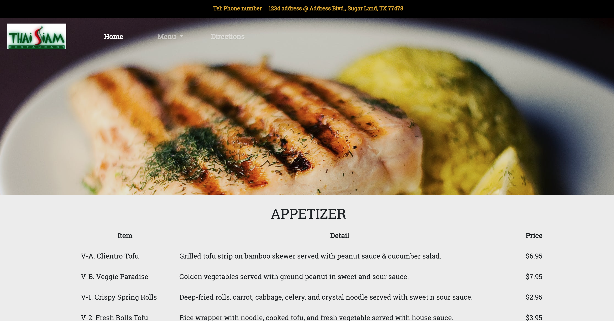
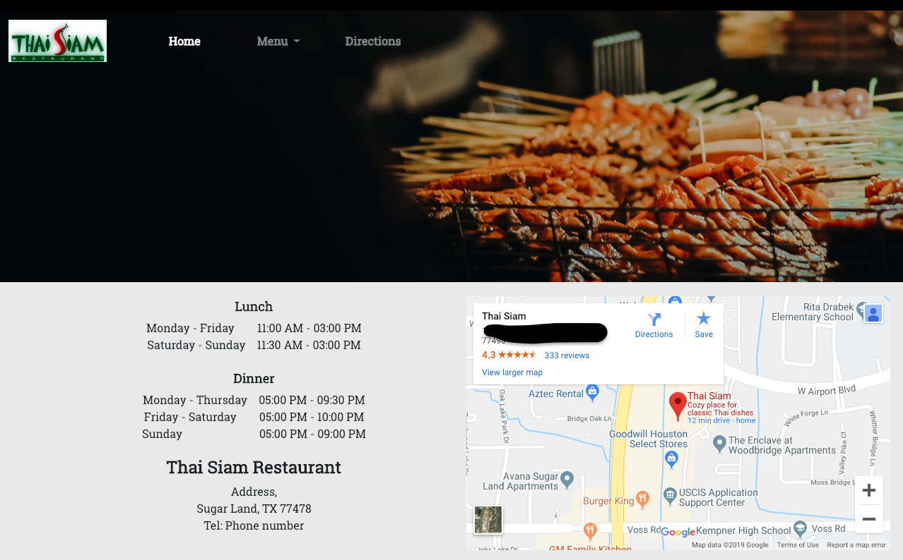
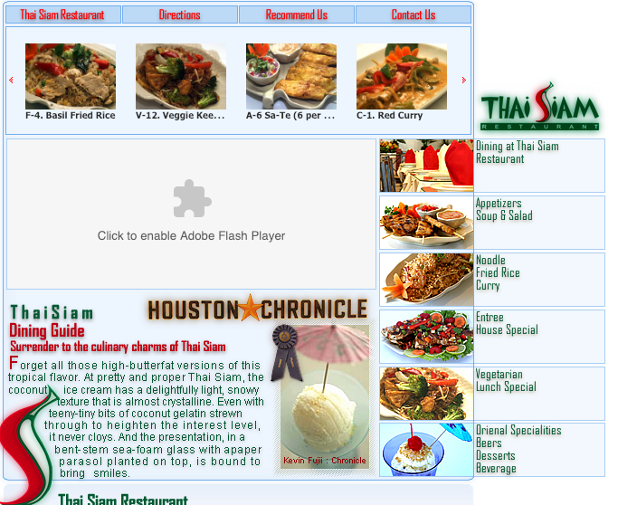

<h1> Restaurant Redesign</h1>

 I did this project in Week 3 of DigitalCrafts. The main purpose of this project is to learn Bootstrap4.

<h1> What I used</h1>
<ul>
<li>Bootstrap4</li>
<li>HTML</li>
<li>CSS</li>
</ul>
<h2>After : index page</h2>

<h2>After : menu page</h2>

<h2>After : direction page</h2>

# phone number and address are hidden purposely

<h2>Before</h2>

